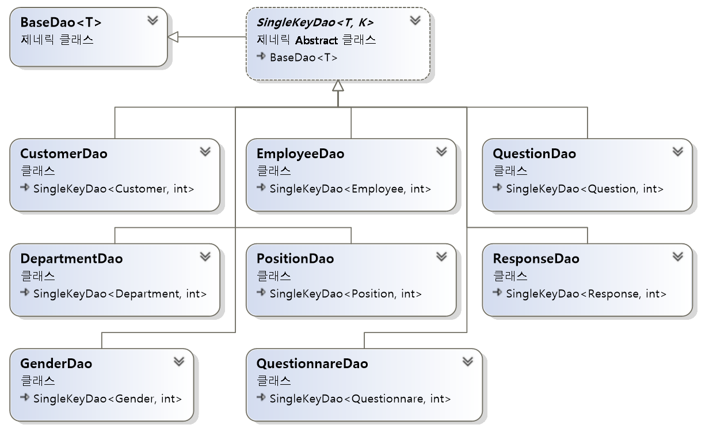
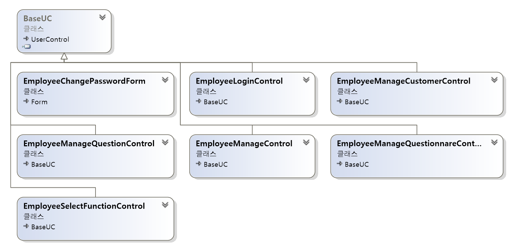
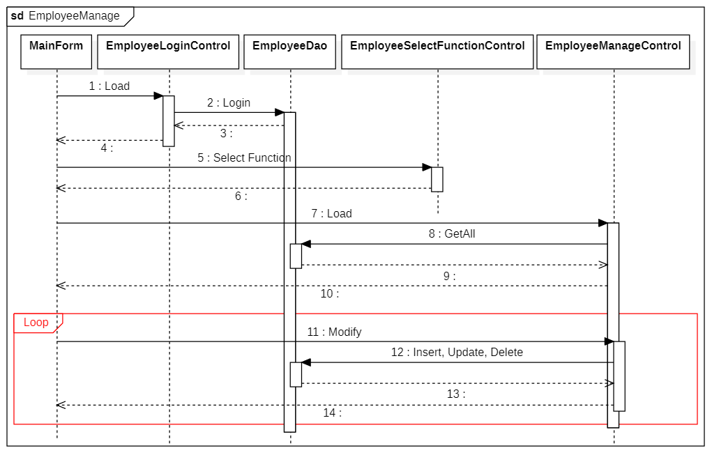

# DKClinic : 전자 문진표 관리 프로그램

# 개요

- 병원에서 제공하는 전자 문진표 작성 및 관리 기능 중 일부를 C# .NET Framework 및 EntityFramework를 이용해 구현하였다.

# 개발 기간

- 2020년 11월 23일 ~ 2020년 11월 29일

# 참여 인원

- IoT기반 스마트팩토리 SW개발 전문가과정
- 김대근, 안성윤, 이동희 총 3명

# 주요 기능

### 1. 고객 정보

- 문진표를 작성한 고객의 정보를 확인할 수 있다. 또한, 고객 정보의 수정 및 삭제가 가능하다.
- 고객 정보를 삭제하게 되면 고객이 작성했던 문진표의 정보도 같이 삭제된다.

### 2. 직원 정보

- 직원들의 정보를 확인할 수 있다. 개인 정보를 포함한 직급 정보와 진료과 정보를 확인할 수 있다.
- 직원의 추가 및 수정, 삭제가 가능하다.

### 3. 문진표 정보

- 작성된 문진표의 정보를 확인할 수 있다. 문진표의 정보는 진료과, 작성 일자 및 작성한 고객의 정보로 이루어져 있다.
- 문진표의 열람 및 삭제가 가능하며, 의사와 병원장의 경우에는 진단 내용 작성이 가능하다.

### 4. 문진표 질문 정보

- 문진표 질문 정보를 진료과별로 확인할 수 있다.
- 문진표의 질문 추가, 수정, 삭제가 가능하다.

# 주요 기능 상세

## 고객용 프로그램

### 1. 기본 정보 입력

[](./Document/고객스크린샷/1_기본정보_입력.jpg)

### 2. 추가 정보 입력

<div>
<a href="./Document/고객스크린샷/2_추가정보_입력.jpg" target="_blank">

</a><a href="./Document/고객스크린샷/2-1_추가정보_입력_기입력자.jpg" target="_blank">

</a></div>

- 이름과 생년월일 정보는 수정되지 않도록 했다.
- 문진표 작성 이력이 있는 환자의 경우, 정보가 미리 출력된다.

### 3. 진료과 선택

<a href="./Document/고객스크린샷/3_진료과_선택.jpg" target="_blank">

</a>

### 4. 문진표 작성

<div>
<a href="./Document/고객스크린샷/4_문진표_작성.jpg" target="_blank">

</a><a href="./Document/고객스크린샷/4-1_문진표_작성_하단부.jpg" target="_blank">

</a></div>

- 질문 종류(주관식, 객관식, 다중선택)에 따라 다른 양식으로 출력된다.
- 문진표를 다 작성한 이후에 ```입력완료```버튼을 누르면 작성한 문진표와 환자 정보가 데이터베이스에 저장되고, ```1. 기본 정보 입력``` 화면으로 돌아가게 된다.

## 직원용 프로그램

### 1. 직원 로그인

<div>
<a href="./Document/직원스크린샷/1_직원_로그인.jpg" target="_blank">

</a><a href="./Document/고객스크린샷/1-1_비밀번호_변경.jpg" target="_blank">

</a></div>

### 2. 작업 선택

<div>
<a href="./Document/직원스크린샷/2-1_작업_선택(병원장).jpg" target="_blank">

</a><a href="./Document/직원스크린샷/2-2_작업_선택(의사).jpg" target="_blank">

</a><a href="./Document/직원스크린샷/2-3_작업_선택(간호사).jpg" target="_blank">

</a></div>

- 직급 별로 선택할 수 없는 작업의 버튼은 비활성화 된다.(짙은회색)

### 3. 문진표 관리

<div>
<a href="./Document/직원스크린샷/3_문진표_관리.jpg" target="_blank">

</a><a href="./Document/직원스크린샷/3-1_문진표_진단내용_작성.jpg" target="_blank">

</a><a href="./Document/직원스크린샷/3-2_문진표_진단내용_비활성.jpg" target="_blank">

</a></div>

- 선택된 문진표의 열람 및 진단서 작성, 삭제가 가능하다

### 4. 문진표 질문 관리

<div>
<a href="./Document/직원스크린샷/4_문진표_질문_관리.jpg" target="_blank">

</a><a href="./Document/직원스크린샷/4-1_질문_추가_및_수정(추가버튼).jpg" target="_blank">

</a><a href="./Document/직원스크린샷/4-2_질문_추가_및_수정(수정버튼).jpg" target="_blank">

</a></div>

- 문진표 질문의 추가, 수정, 삭제가 가능하다
- 질문의 유형은 주관식, 객관식, 다중선택이다
- 수정 후 ```일괄저장```버튼을 눌러야 데이터베이스에 저장된다

### 5. 환자 정보 관리

<div>
<a href="./Document/직원스크린샷/5_환자_정보_관리.jpg" target="_blank">

</a><a href="./Document/직원스크린샷/5-1_환자_정보_수정.jpg" target="_blank">

</a></div>

- 선택된 환자의 정보 수정 및 삭제가 가능하다

### 6. 직원 정보 관리

<div>
<a href="./Document/직원스크린샷/6_직원_정보_관리.jpg" target="_blank">

</a><a href="./Document/직원스크린샷/6-1_직원_정보_추가_및_수정(추가버튼).jpg" target="_blank">

</a><a href="./Document/직원스크린샷/6-2_직원_정보_추가_및_수정(수정버튼).jpg" target="_blank">

</a></div>

- 직원의 추가가 가능하다. 직원 추가 시 비밀번호는 초기값(password)으로 자동 저장된다
- 선택된 직원의 수정 및 삭제가 가능하다


# 사용 기술

## 언어

- C# 8.0

## 프레임워크

- .Net FrameWork 4.8
- EntityFrameWork 6.2
- Winform

## 데이터베이스

* MSSQL Server 2019

## 기타 개발환경

- Windows 10
- Microsoft Visual Studio Community 2019 v16.8
- Microsoft SQL Server Management Studio v18.6

# 데이터베이스 스키마


- 모든 항목이 제 3 정규화까지 완료됐다

# 유저 케이스 다이어그램


# 플로우차트

## 1. 고객용 프로그램


## 2. 직원용 프로그램


# 클래스 다이어그램

## 1. DAO(Data Access Object)



## 2. 고객용 프로그램


## 3. 직원용 프로그램



# 시퀸스 다이어그램

## 직원 관리 시퀸스



# Point of Interest

# DB 테이블의 속성 변경 등 업데이트 내역이 EntityFramework에 반영되지 않은 문제 [#24](https://github.com/dlehd333/DKClinic/issues/24)

## 증상
- 문진표 저장을 누를 시 에러 발생

## 원인
- EntityFramework로 불러온 데이터베이스의 문진표 테이블 PK컬럼의 IDENTITY_INSERT 속성이 OFF로 되어있었다

## 결과
- 처음에는 DB에 있는 문진표 테이블 PK컬럼의 IDENTITY_INSERT 속성을 ON으로 변경했다. 하지만 같은 오류가 발생했다.
- 확인 결과, 처음에 DB 스키마 설계 시 테이블 PK에 IDENTITY_INSERT 속성을 ON으로 바꾸지 않았고, 그 상태로 EntityFramework로 불러와, EntityFramework상에는 IDENTITY_INSERT 속성이 OFF로 저장되어 있었다.
- 그래서, EntityFramework 다이어그램에서 우클릭으로 제공하는 '데이터베이스에서 모델 업데이트'메뉴를 실행, 업데이트 마법사를 이용해 DB의 정보를 업데이트하여 문제를 해결함


---

# 외래키로 연결된 여러 테이블의 값을 동시에 삽입하는 트랜잭션 진행중에 에러가 발생하는 문제 [#24](https://github.com/dlehd333/DKClinic/issues/24)

## 증상
- 새로운 Customer(환자)가 문진표를 입력하면, 에러가 발생

## 원인
- 신규 환자가 문진표 입력이 완료되면 Customer(고객), Questionnare(문진표), Response(문진표응답) 총 3개의 테이블에 데이터가 삽입되는데, 이 때 신규 환자는 등록 전에는 CustomerID가 없어, Customer테이블에서 키값의 최대값을 가져와 등록했는데 이 값이 실제 IDENTITY 컬럼을 통해 저장되는 내용과 맞지 않아 오류가 발생했다
- 여러 테이블의 데이터가 동시에 저장되는 트랜잭션을 끊지 않고 IDENTITY 컬럼의 값을 미리 구해서 저장하거나 다른 방법이 필요했다.

## 결과
- 처음에는 C#에서 IDENTITY 컬럼의 값을 구하는 법을 찾고 있었는데, 검색 하던 도중 다른 방법을 발견했다
- EF가 ID값을 찾아 할당하는 것이 아니라 테이블 개체 자체를 할당하는 기능을 지원하며, EF로 생성된 Entity 모델에 생성되어 있는 외래키로 연결된 하위 모델을 이용해 연결할 수 있다는 것을 알게 되었다.
- 그래서 Entity 모델의 개체를 생성할 때 상위 테이블 개체를 연결해주면, 한번에 SaveChange를 진행해도 Insert된 개체에 대해 자동으로 ID키가 연결되어 에러가 발생하지 않고 트랜젝션도 깨지지 않게 된다.
- 그래서 개체를 생성할 때, 상위 테이블 개체를 연결해주는 작업을 진행했다.

```csharp
public Questionnare CreateQuestionnare { get; set; }

// before
CreateQuestionnare = new Questionnare();
// after
CreatedQuestionnare = new Questionnare { Customer = ConnectedCustomer };
```

---

# 포커스 변화에 따라 강제로 스크롤이 조절되는 문제 [#26](https://github.com/dlehd333/DKClinic/issues/26)

## 증상
- "입력완료"버튼을 누르면 패널 컨트롤의 스크롤이 맨 위로 올라가는 현상

## 원인
- 확인 결과, 휠 스크롤이나 다른 행동을 한 이후 패널 컨트롤 내에 있는 다른 컨트롤을 클릭하여 Focus가 되면, 패널 컨트롤이 ActiveControl로 간주가 되어 어떤 경로를 통해ScrollableControl.ScrollToControl 메서드가 실행되고 스크롤 위치가 강제로 옮겨지는 것으로 판단된다.

## 결과
- ScrollToControl이 가상 메서드이기 때문에, 패널 컨트롤을 상속받는 CustomPanel클래스를 만들고 ScrollToControl 메서드를 오버라이드하여 우리가 원하는 동작을 하도록 수정하여 해결
- 문제를 해결하긴 했지만, 정확하게 ScrollToControl이 어떤 원리로 동작하는지와 패널과 스크롤의 상관관계를 정확하기 이해하지는 못함

```csharp
public class CustomPanel : System.Windows.Forms.Panel
{
    protected override System.Drawing.Point ScrollToControl(System.Windows.Forms.Control activeControl)
    {
        // Returning the current location prevents the panel from
        // scrolling to the active control when the panel loses and regains focus
        return this.DisplayRectangle.Location;
    }
}
```
- 출처
https://blog.naver.com/raon_pgm/150185087803
https://nickstips.wordpress.com/2010/03/03/c-panel-resets-scroll-position-after-focus-is-lost-and-regained/

---

# 클래스 단위로 데이터 관리 중 얕은 복사로 인해 데이터의 손실이 일어난 문제 [#61](https://github.com/dlehd333/DKClinic/issues/61)

## 증상
- 문진표 문제 관리에서 문제를 중간에 추가하거나, 문제의 위치를 수정하는 등의 위치 변경 작업이 진행될 때, 변경된 문제로 인해 함께 변경되는 다른 문제들의 인덱스가 비정상적으로 변하는 문제

## 원인
- 문진표 문제 관리를 데이터가 변경될 때 마다 데이터베이스로 직접 연결해 변경하는 것이 아니라, 프로그램 내 객체로 관리를 하다보니 자연스럽게 클래스(Entity)단위로 관리를 하게 되는데, 클래스가 참조 타입이기 때문에 데이터를 복사하여 추가하는 과정에서 '얕은 복사'가 발생해 데이터 변경 로직이 꼬였다.

## 결과
- 데이터를 복사해 수정하는 부분 중 개체가 '복사'되는 부분에서 '깊은 복사'기능을 구현하여 적용하여 해결했다
- 깊은 복사 기능은 EF로 생성된 Entity 클래스를 Patial클래스로 다른곳에서 작업하여 깊은 복사 기능(메서드)을 만들어 해결했다.
- 깊은 복사 기능을 하는 Clone메서드를 만들때는 C#에서 제공하는 ICloneable 인터페이스를 상속하여 작업했다.

```csharp
public partial class Question : ICloneable
{
    public object Clone()
    {
        Question question = new Question();
        // ...
        return question;
    }
}
```

```csharp
// before
Question question = AfterQuestions.FindAll(x => x.Index == i)
    .OrderByDescending(x => x.Version)
    .FirstOrDefault();
question.Index++;

// after
var data = AfterQuestions.FindAll(x => x.Index == i)
    .OrderByDescending(x => x.Version)
    .FirstOrDefault();
Question question = (Question)data.Clone();
question.Index++;
```

---

# 간헐적으로 접속중인 직원의 정보가 사라지는 문제 [#74](https://github.com/dlehd333/DKClinic/issues/74)

## 증상
- 접속하여 작업 후 다른 id로 로그인 시 간헐적으로 오류 발생

## 원인
- 진단 내용 작성 폼에 전달된 접속중인 직원의 ID값이 null로 됨
- 원인을 찾던 중, 문진표 관리 뒤로가기 버튼 이벤트 활성 시 접속중인 직원의 정보가 전달이 되지 않는 문제를 발견

## 결과
- 문진표 관리 뒤로가기 버튼 이벤트 활성 시, 이벤트 핸들러를 통해 접속중인 직원의 정보가 전달되도록 변경함. 또한, 문진표 질문 관리, 직원 관리, 고객 관리의 각 버튼 이벤트 핸들러 구문에 접속중인 직원의 정보가 전달되도록 수정
- 문제의 발생 빈도와 조건이 정확하게 규명되지 않은 문제이므로, 적용된 솔루션을 통해 해당 문제가 완전히 해결되었다고 단언할 수 없음. 추가 테스트를 통해 해당 오류 발견시 조치 필요

```csharp
// before
private void btnGoBack_Click(object sender, EventArgs e)
{
    EmployeeSelectFunctionControl employeeSelectFunctionControl = 
        new EmployeeSelectFunctionControl();
    OnbtnCancelClicked(employeeSelectFunctionControl);
}

// after
private void btnGoBack_Click(object sender, EventArgs e)
{
    EmployeeSelectFunctionControl employeeSelectFunctionControl = 
        new EmployeeSelectFunctionControl(currentEmployeeInHere);
    OnbtnCancelClicked(employeeSelectFunctionControl);
}
```